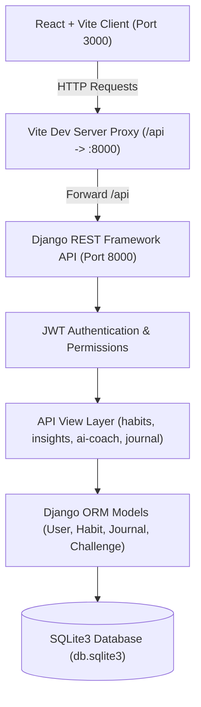

# ZenHabit: Advanced Habit Tracking & Performance Management System

> **A full-stack habit engineering platform built with React + Vite frontend and Django REST Framework backend.**  
> Designed for personal productivity, cognitive habit architecture, streak retention, and AI-driven behavior optimization.

---

## 📌 Project Overview & Prompt

### Project Title
**ZenHabit – A Personal Habit Monitoring and Progress Management System**

### System Specification & Prompt
> Develop a full-stack Habit Tracker web application that helps users construct, monitor, and maintain positive daily habits with psychological reinforcement and gamified incentives.
> 
> The system provides secure user authentication, an interactive dashboard, complete habit management (create, edit, archive, priority levels, scheduled days, custom color palettes), daily completion and skip mechanisms, real-time streak algorithms, statistical analytics, historical calendar heatmaps, community challenges, badge unlocks, XP/leveling engines, mood journals, persistent reminder configurations, profile goals, dark/light themes, and server-generated CSV data export.

---

## 🚀 Key Features Matrix

### 1. Core Platform Capabilities
- **Authentication & Security**: Custom User model, JWT token authentication (`PyJWT`), password hashing via Django, protected endpoints with `IsAuthenticated`.
- **Dynamic Dashboard**:
  - Time-of-day greeting & randomized motivational quotes.
  - Personal daily completion target meter (e.g. 4/4 habits target met).
  - Streak protection banner & predictive risk alerts.
  - Recommended Focus Habit with context-aware rationale.
  - Quick 1-click check-in list, streak leaderboards, and active challenges preview.
- **Habit Engineering & Management**:
  - Full CRUD + Archive/Unarchive (`GET`, `POST`, `PUT`, `PATCH`, `DELETE`).
  - **Priority Tagging**: High 🔴, Medium 🟡, Low 🔵.
  - **Category Segregation**: Health, Fitness, Study, Mindfulness, Social, Custom.
  - **Scheduled Days**: Custom weekday schedules (Mon–Sun chips).
  - **Color Customization**: Preset palette + color picker per habit.
  - **Habit Descriptions**: Actionable cues, routine notes, and micro-steps.
  - **Persistent Reminders**: Stored reminder times with active/inactive toggles.
- **Daily Check-in & Streak Logic**:
  - Automatic streak calculation factoring in timezones and yesterday/today completion.
  - Skip functionality to freeze streaks on rest days.
  - Duplicate check-in prevention for the same calendar date.
- **Gamification Engine**:
  - XP progression (+15 XP for check-in, +25 XP for habit creation, +20 XP for journaling, +80 XP for badges).
  - Dynamic level scaling (`Level * 1.4` threshold progression).
  - Unlocked Achievement Badges: *Starter Badge*, *Bronze (7d)*, *Silver (15d)*, *Legend (21d)*, *Gold (30d)*, *Consistency Master (50 check-ins)*, *Diverse Habits (3+ categories)*, *Perfect Day*.
- **Interactive Journal**:
  - Daily mood selection (😄, 🙂, 😐, 😔, 😤) + text reflection with chronological timeline.
- **Timed Challenges**:
  - Join/leave structured challenges (e.g. *30-Day Fitness*, *Hydration Hero*, *Study Streak*) with progress tracking.
- **Historical Heatmap & Calendar**:
  - Monthly calendar view with multi-tiered green intensity and missed markers.
  - Chronological recent check-in activity feed.

---

## 🧠 Advanced Programming & Smart Analytics

ZenHabit includes advanced server-side algorithms:

1. **Smart Insights Dashboard (`/api/insights`)**:
   - **Predictive Streak-Break Detection**: Detects ongoing streaks at risk of breaking before midnight, calculating remaining hours and risk severity (Low / Medium / High).
   - **Focus-Habit Recommendation**: Algorithmic selection of today's highest-leverage habit based on priority level and active streak retention.
   - **Category Performance Breakdown**: Real-time server calculations measuring total check-ins, active habits, and today's completion rates across lifestyle pillars.
   - **Intelligent Habit Recommendations**: Automated heuristic recommendations for missing categories to foster well-rounded development.
   - **Mood vs. Habit Performance Correlation**: Correlates journal sentiment ratings with daily completion counts.

2. **AI Habit Coach (`/api/ai-coach`)**:
   - Contextual coaching engine analyzing user habit count, active streaks, and high-priority goals.
   - Generates actionable advice, habit stacking suggestions, and step-by-step optimization strategies.

3. **Server-Generated CSV Export (`/api/habits/export/csv`)**:
   - Streams an RFC-compliant CSV download containing complete habit metadata: priority, streaks, target days, total check-ins, reminders, status, and creation timestamps.

4. **Timezone Adaptation**:
   - Stores user timezone in database (`UTC`, `Asia/Kolkata`, `America/New_York`, etc.).
   - Converts UTC ISO strings to the user's localized date for streak calculations.

---

## 🛠️ Technology Stack

| Layer | Technology | Description |
|---|---|---|
| **Frontend** | React 18, Vite | High-performance SPA with fast HMR |
| **Styling** | Vanilla CSS Design System | Custom tokens, dark/light theme, responsive grid |
| **Icons & Charts** | Lucide React, Chart.js | Modern vector iconography & responsive canvas charts |
| **Backend** | Python 3.10+, Django 5.x | Enterprise-grade web framework |
| **API Layer** | Django REST Framework (DRF) | Token-authenticated RESTful API endpoints |
| **Database** | SQLite3 | Local relational storage with Django ORM migrations |
| **Authentication**| JSON Web Tokens (PyJWT) | Stateless 7-day authentication tokens |
| **Timezone Support**| `zoneinfo` + `tzdata` | Standard library timezone management |

---

## 📂 System Architecture



---

## 🗄️ Database Schema & Models

### `User` Model (extends `AbstractUser`)
- `name`: Full display name
- `email`: Unique email (serves as login identifier)
- `badges`: JSON array of unlocked badge titles
- `goal`: Focus goal (e.g., "Build study habits", "All-round improvement")
- `dailyTarget`: Integer representing target completions per day (default `4`)
- `bio`: Text biography / personal mission statement
- `timezone`: Timezone identifier string (e.g. `UTC`, `Asia/Kolkata`)

### `Habit` Model
- `user`: Foreign key to `User` (Cascade delete)
- `title`: Habit name (CharField)
- `description`: Detailed cues and notes (TextField)
- `category`: Category string (`Health`, `Fitness`, `Study`, `Mindfulness`, `Social`, `Custom`)
- `icon`: Emoji icon string (e.g., `⭐`, `🏃`, `💧`)
- `frequency`: `Daily`, `Weekdays only`, `Weekends`
- `priority`: `High`, `Medium`, `Low`
- `color`: Hex color string (e.g., `#10b981`)
- `scheduledDays`: JSON list of active days (`['Mon', 'Tue', 'Wed', ...]`)
- `reminderTime`: 24h time string (e.g., `08:00`)
- `reminderEnabled`: Boolean toggle
- `isArchived`: Boolean flag for archiving
- `target`: Target days goal (default `30`)
- `streak`: Current consecutive day streak
- `longestStreak`: Personal best streak record
- `completedDates`: JSON array of UTC ISO date strings
- `skippedDates`: JSON array of UTC ISO date strings
- `createdAt`: Timestamp of habit creation

### `JournalEntry` Model
- `user`: Foreign key to `User`
- `date`: Formatted date string
- `mood`: Emoji indicator (`😄`, `🙂`, `😐`, `😔`, `😤`)
- `text`: Written reflection
- `createdAt`: Auto-generated timestamp

### `UserChallenge` Model
- `user`: Foreign key to `User`
- `challengeId`: Reference challenge integer
- `name`, `icon`, `cat`, `days`, `color`, `bg`
- `joined`: Boolean participation flag
- `prog`: Current day count

---

## 📡 REST API Reference

| Endpoint | Method | Auth | Description |
|---|---|---|---|
| `/api/auth/register` | `POST` | Public | Register new user account |
| `/api/auth/login` | `POST` | Public | Authenticate user & return JWT token |
| `/api/auth/me` | `GET` | Bearer | Get current user profile & badges |
| `/api/auth/profile` | `PUT/PATCH` | Bearer | Update profile, goal, daily target, timezone |
| `/api/habits` | `GET` | Bearer | List active/archived habits with updated streaks |
| `/api/habits` | `POST` | Bearer | Create a new habit with priority, color, days |
| `/api/habits/<id>` | `GET` | Bearer | Get single habit details |
| `/api/habits/<id>` | `PUT/PATCH` | Bearer | Update habit fields |
| `/api/habits/<id>` | `DELETE` | Bearer | Delete habit |
| `/api/habits/checkin/<id>` | `POST` | Bearer | Complete habit today & evaluate badges |
| `/api/habits/skip/<id>` | `POST` | Bearer | Skip habit today without streak loss |
| `/api/habits/archive/<id>` | `POST` | Bearer | Toggle archive state of a habit |
| `/api/habits/export/csv` | `GET` | Bearer | Download server-generated CSV export |
| `/api/insights` | `GET` | Bearer | Get predictive streak risks, focus habit, category metrics |
| `/api/ai-coach` | `POST` | Bearer | Receive tailored coaching advice & action plan |
| `/api/journal` | `GET`, `POST` | Bearer | List and create journal reflections |
| `/api/challenges` | `GET` | Bearer | List default or user-specific challenges |
| `/api/challenges/join/<id>` | `POST` | Bearer | Toggle challenge participation |

---

## 🔮 Future High-Level Features (Roadmap)

The project architecture is prepared for the following enterprise and AI enhancements:

1. **AI Habit Coach with LLM Integration**:
   - Connection with Google Gemini API for multimodal voice conversations and autonomous weekly routine auditing.
2. **Predictive Streak-Break Machine Learning**:
   - Time-series classification based on day-of-week velocity, historical completion timestamps, and calendar conflict detection.
3. **Adaptive Habit Difficulty**:
   - Dynamic micro-goals (e.g. adjusting "Read 30 mins" to "Read 10 mins" when user stress levels spike in the journal).
4. **Calendar & Smartwatch Sync**:
   - Two-way Google Calendar / Apple Health / Fitbit sync for automated check-ins upon completing fitness runs or sleep goals.
5. **Social Accountability & Squads**:
   - Shared group streaks, peer accountability alerts, and team habit challenges.
6. **Progressive Web App (PWA) Offline Engine**:
   - Service worker cache with Background Sync API to support habit check-ins in zero-connectivity environments.
7. **Omnichannel Notification Service**:
   - Web Push, SMS, and WhatsApp bot reminders triggered at optimal personalized times.

---

## 💻 Installation & Setup Guide

### Prerequisites
- Python 3.10 or higher
- Node.js 18 or higher (includes npm)

### 1. Backend Setup (Django)

Open Terminal 1:
```powershell
# Navigate to the server directory
cd habit-tracker\server

# Activate the existing virtual environment (or create a new one)
.venv\Scripts\activate

# Install dependencies (if setting up fresh)
pip install -r requirements.txt

# Apply database migrations
python manage.py migrate

# Start the Django development server
python manage.py runserver 8000
```
*The Django server will be running on `http://127.0.0.1:8000`.*

### 2. Frontend Setup (React + Vite)

Open Terminal 2:
```powershell
# Navigate to the client directory
cd habit-tracker\client

# Install frontend dependencies
npm install

# Start the Vite development server
npm run dev
```
*The React client will be accessible at `http://localhost:3000`.*

---

## 🧪 Verification & Testing

1. Open your browser and navigate to `http://localhost:3000`.
2. Register a new user account (e.g., `user@example.com` / `password123`).
3. You will be placed on the **Dashboard** displaying your daily target meter, focus habit, and streak leaders.
4. Go to **My Habits**:
   - Click `+ New Habit`.
   - Set Title, Notes, Emoji, Priority (`High`), Category (`Health`), Scheduled Days, and Accent Color.
   - Click `Create Habit`.
5. Test habit interactions:
   - Check-in (✓): observe the XP increment, streak increment, and confetti toast.
   - Edit (✏️): modify any property.
   - Archive (📦): switch to the *Archived* tab to verify safe storage.
6. Open **Smart Insights**:
   - Review the predictive streak-break status and focus recommendation.
   - Ask the AI Habit Coach a question or click a prompt chip.
   - Add a suggested habit directly from the recommendations card.
7. Open **Settings**:
   - Adjust your personal Daily Completion Target (e.g., 5 habits).
   - Click `Export CSV` to download the comprehensive data export.


